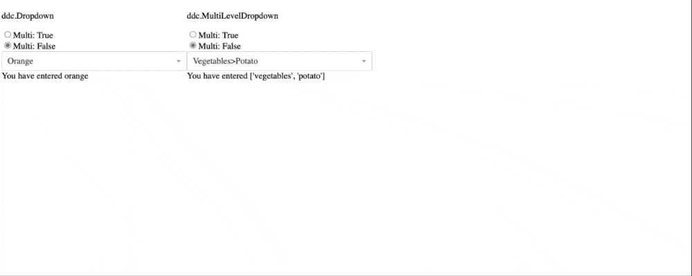

[](https://pepy.tech/projects/dash-dropdown-components)

# 📦 dash_dropdown_components

Custom dropdown components for [Plotly Dash](https://dash.plotly.com/) similar to [dcc.Dropdown](https://dash.plotly.com/dash-core-components/dropdown), 
offering advanced functionality such as nested options and improved multi-select behavior.

## 📥 Installation

```bash
pip install dash-dropdown-components
```

## Showcase


## 🧩 Components

### 🔽 Dropdown

A customizable dropdown component that enhances the standard Dash dropdown with additional features.

#### ✅ Features

- **Emulates [dcc.Dropdown](https://dash.plotly.com/dash-core-components/dropdown)** - Drop-in replacement for most use cases.
- **Stays open on select** – When `multi=True`, the dropdown stays open after selection (unlike `dcc.Dropdown`).
- **Smart multi→single behavior** 
    – When switching `multi=True` to `multi=False` dynamically, the first selected item is automatically preserved—no need for callbacks.
    – Clearable for `multi=True` and not clearable for `multi=False` by default, or control using `clearable` option.
- **Multi-select support** – Supports selecting multiple items.
- **Searchable** – Optionally enable a search term.

#### ⚙️ Properties

| Property                 | Type               | Description                                                                                                                                           |
|--------------------------|--------------------|-------------------------------------------------------------------------------------------------------------------------------------------------------|
| `id`                     | `string`           | Unique component ID                                                                                                                                   |
| `options`                | `list[dict,str]`   | List of options with `label` and `value` keys, or list with values                                                                                    |
| `value`                  | `string` or `list` | Selected value(s)                                                                                                                                     |
| `multi`                  | `bool`             | Enable multiple selections                                                                                                                            |
| `searchable`             | `bool`             | Enables search                                                                                                                                        |
| `clearable`              | `bool`             | Whether or not the dropdown is "clearable", that is, whether or not a small "x" appears on the right of the dropdown that removes the selected value. |
| `placeholder`            | `string`           | Placeholder text when nothing is selected                                                                                                             |
| `disabled`               | `bool`             | If True, this dropdown is disabled and the selection cannot be changed.                                                                               |
| `hide_options_on_select` | `bool`             | If True, options are removed when selected                                                                                                            |
| `style`                  | `bool`             | Whether dropdown closes on selection (default `True`)                                                                                                 |
| `className`              | `string`           | Optional CSS class for styling                                                                                                                        |

---

### 🌲 MultiLevelDropdown

A hierarchical dropdown component that supports nested options (multilevel structure), allowing for structured category selection.

#### ✅ Features

- **Nested options** – Supports arbitrarily nested dropdowns.
- **Expandable submenus** – Submenus open and close interactively.
- **Custom labels** – Each level supports custom labeling and values.

#### ⚙️ Properties

| Property                 | Type               | Description                                                                                                                                           |
|--------------------------|--------------------|-------------------------------------------------------------------------------------------------------------------------------------------------------|
| `id`                     | `string`           | Unique component ID                                                                                                                                   |
| `options`                | `list[dict,str]`   | List of dicts of options with `label`, `value` and `suboptions` keys                                                                                  |
| `value`                  | `string` or `list` | Selected value(s)                                                                                                                                     |
| `multi`                  | `bool`             | Enable multiple selections                                                                                                                            |
| `clearable`              | `bool`             | Whether or not the dropdown is "clearable", that is, whether or not a small "x" appears on the right of the dropdown that removes the selected value. |
| `placeholder`            | `string`           | Placeholder text when nothing is selected                                                                                                             |
| `disabled`               | `bool`             | If True, this dropdown is disabled and the selection cannot be changed.                                                                               |
| `hide_options_on_select` | `bool`             | If True, options are removed when selected                                                                                                            |
| `submenu_widths`         | `list`             | Control the width of the submenu for each level. Can be in percentage of the preceding level or fixed widths                                          |
| `style`                  | `bool`             | Whether dropdown closes on selection (default `True`)                                                                                                 |
| `className`              | `string`           | Optional CSS class for styling                                                                                                                        |

---

### 💡 Usage Example

```python
import dash_dropdown_components as ddc
from dash import Dash, callback, html, Input, Output, dcc

app = Dash(__name__)

options = [
    {'value': 'banana', 'label': 'Banana'},
    {'value': 'apple', 'label': 'Apple'},
    {'value': 'strawberry', 'label': 'Strawberry'},
    {'value': 'kiwi', 'label': 'Kiwi'},
    {'value': 'orange', 'label': 'Orange'},
    {'value': 'blueberry', 'label': 'Blueberry'},
    {'value': 'lemon', 'label': 'Lemon'},
    {'value': 'lime', 'label': 'Lime'},
    {'value': 'mandarin', 'label': 'Mandarin'},
]

multi_level_options = [
    {
        'label': 'Fruits',
        'value': 'fruits',
        'suboptions': [
            { 'label': 'Apple', 'value': 'apple' },
            { 'label': 'Banana', 'value': 'banana' },
            { 'label': 'Berries',
              'value': 'berries',
              'suboptions': [
                  { 'label': 'Strawberry', 'value': 'strawberry'},
                  { 'label': 'Blueberry', 'value': 'blueberry'}
                ]
            }
    ]},
    {
        'label': 'Vegetables',
        'value': 'vegetables',
        'suboptions': [
            {
            'label': 'Potato',
            'value': 'potato'
            },
            {
            'label': 'Carrot',
            'value': 'carrot'
            },
    ]}
]; 

app.layout = html.Div(
    [
html.Div([
        html.P('ddc.Dropdown'),
        dcc.RadioItems(id='ddc-dd-multi',
                       options=[{'label': 'Multi: True', 'value': True},
                                {'label': 'Multi: False', 'value': False}],
                       value=False),
        ddc.Dropdown(
            id='ddc-dd',
            options=options,
            value=options[0]['value'],
            multi=False,
            disabled=False,
            searchable=True,
            hide_options_on_select=True
        ),
        html.Div(id='ddc-dd-selection')
    ], style={'width': '25%', 'display': 'inline-block'}),
html.Div([
        html.P('ddc.MultiLevelDropdown'),
        dcc.RadioItems(id='ddc-mldd-multi',
                       options=[{'label': 'Multi: True', 'value': True},
                                {'label': 'Multi: False', 'value': False}],
                       value=False),
        ddc.MultiLevelDropdown(
            id='ddc-mldd',
            options=multi_level_options,
            value=['fruits', 'banana'],
            multi=False,
            disabled=False,
            hide_options_on_select=True,
            submenu_widths=['10vw', '20vw']
        ),
        html.Div(id='ddc-mldd-selection')
    ], style={'width': '25%', 'display': 'inline-block'}),
],
style={'display': 'flex', 'flexDirection': 'row'})


@callback(Output('ddc-dd-selection', 'children'),
          Input('ddc-dd', 'value'))
def display_output(value):
    return 'You have entered {}'.format(value)

@callback(Output('ddc-mldd-selection', 'children'),
          Input('ddc-mldd', 'value'))
def display_output(value):
    return 'You have entered {}'.format(value)

@callback(Output('ddc-dd', 'multi'),
          Input('ddc-dd-multi', 'value'))
def set_multi(multi):
    return multi

@callback(Output('ddc-mldd', 'multi'),
          Input('ddc-mldd-multi', 'value'))
def set_multi(multi):
    return multi


if __name__ == '__main__':
    app.run(debug=True)
```

---

## 📝 License

This project is licensed under the **MIT License**. See the [LICENSE](./LICENSE) file for details.

---

## 🔗 Links

- [GitHub Repository](https://github.com/WWakker/dash_dropdown_components)
- [Dash Documentation](https://dash.plotly.com/)
